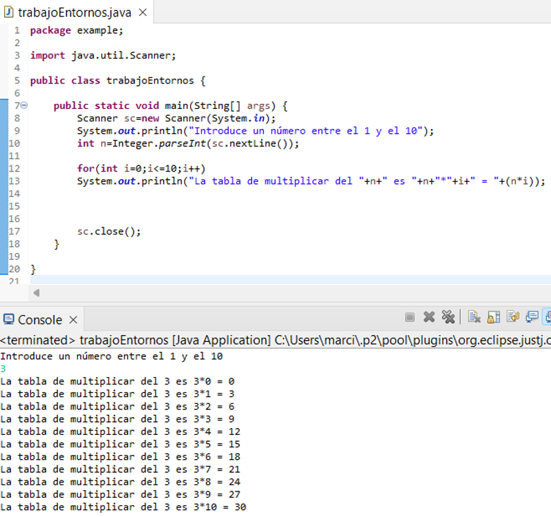
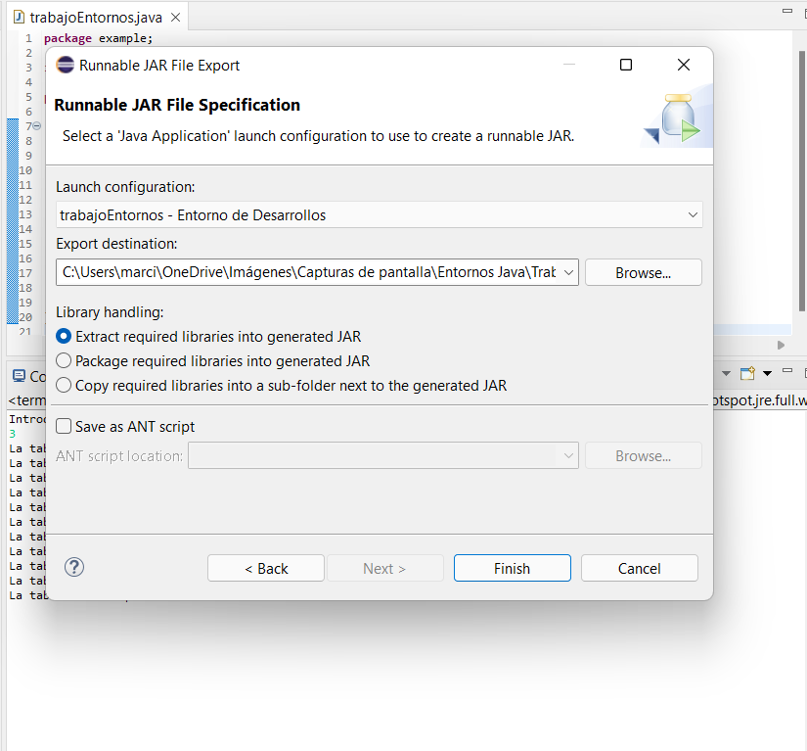
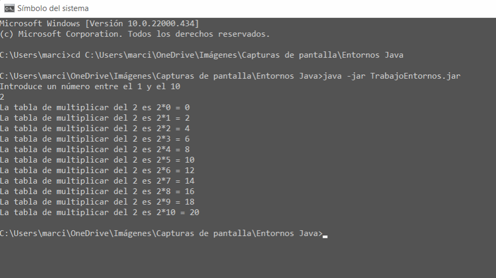
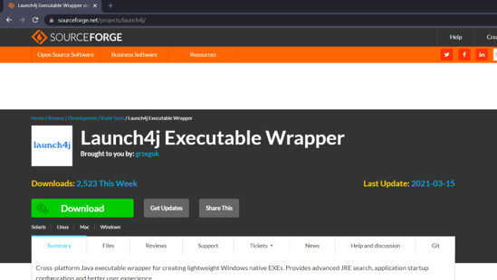
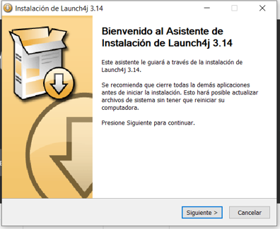
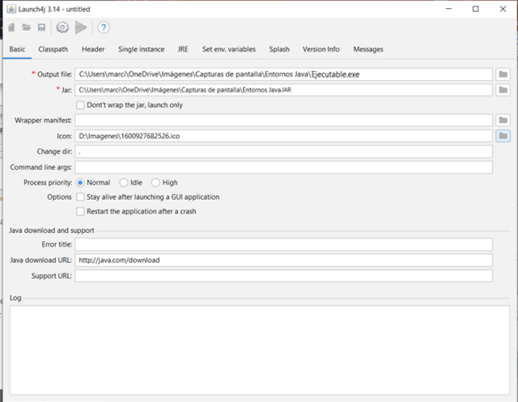
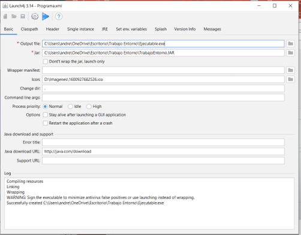

## INDICE
[1. Crear la aplicación](#crear-la-aplicación)

[2. JarFile (exportar código)](#jarfile)

[3. Símbolo del sistema](#símbolo-del-sistema)

[4. Instalar Launch4j](#instalar-launch4j)

[5. Configuración de Launch4j](#configuración-de-launch4j)

---

> ### *Crear la aplicación*
>>Crear un código java en eclipse 

---
[^Volver al Incide^](#indice)
> ### *JarFile*
>>1. Seleccione       
>>2. Después seleccionamos  
>>3. Después 
>>4. Y por ultimo, seleccionar nuestro java project

---
[^Volver al Incide^](#indice)

> ### *Símbolo del sistema*
>>Comprobar que funciona el código realizado de java

---
[^Volver al Incide^](#indice)
>### *Instalar Launch4j*
>>Descargamos y instalamos Launch4j, sirve para pasar de .JAR a .exe

---
[^Volver al Incide^](#indice)

> ### *Configuración de Launch4j*
>>1. Tenemos que añadir donde queremos que se cree con el nombre y su extensión .exe
>>2. Luego donde esta el .JAR
>>3. Y si queremos añadir una imagen, y listo para ejecutar. 
 
---
[^Volver al Incide^](#indice)

